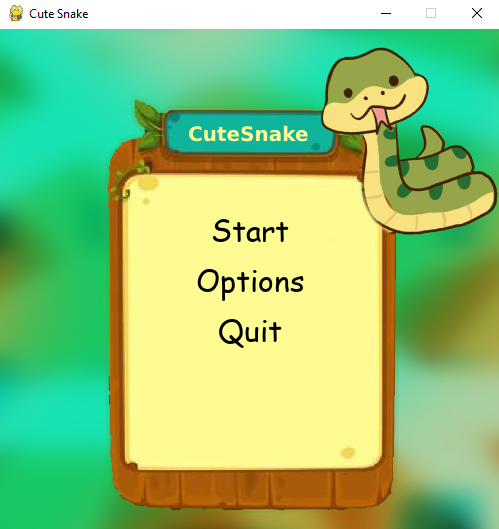
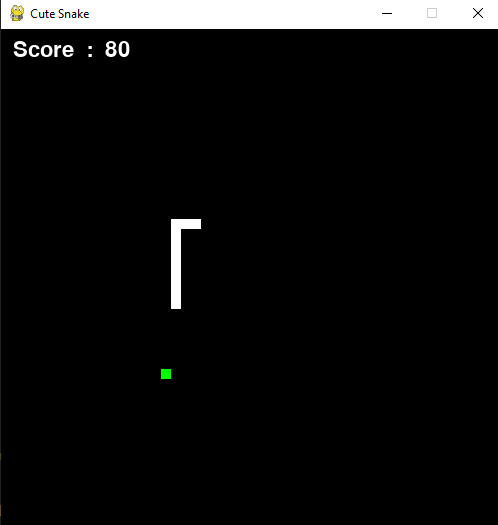
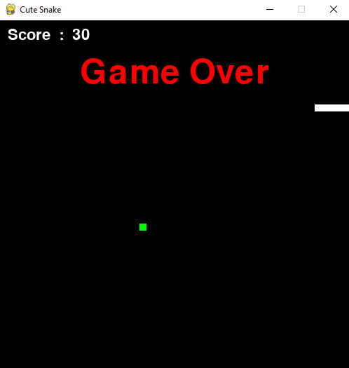

# Cute Snake Game

This is a simple snake game implemented in Python using the Pygame library.

## Features

- Classic snake gameplay
- Menu with options to start the game
- Game over screen with the final score

## Screenshots

### Main Menu

  

### Gameplay

  

### Game Over

  

## How to Run

1. Make sure you have Python installed on your system.
2. Install the Pygame library by running `pip install pygame`.
3. Clone this repository to your local machine.
4. Navigate to the project directory.
5. Run the `main.py` file using Python: `python main.py`.

## Controls

- Use the arrow keys or WASD to control the snake.
- Press Esc to pause the game and return to the main menu during gameplay.

## Credits
- menu image by [Passion-pearl](https://www.shutterstock.com/image-vector/set-ui-elements-2d-games-apps-1251755533?irgwc=1&pl=38919-1636534&utm_campaign=Eezy%2C%20LLC&utm_content=1636534&utm_medium=Affiliate&utm_source=38919&utm_term=www.vecteezy.com).
- snake image by [vizi clipart](https://groups.google.com/g/viziclipart/c/kWPZ3lZmexQ/m/i3ayFTTCAAAJ?pli=1).
- background image by [Michail Chourdas](https://github.com/Polilogas).

